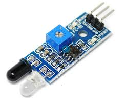
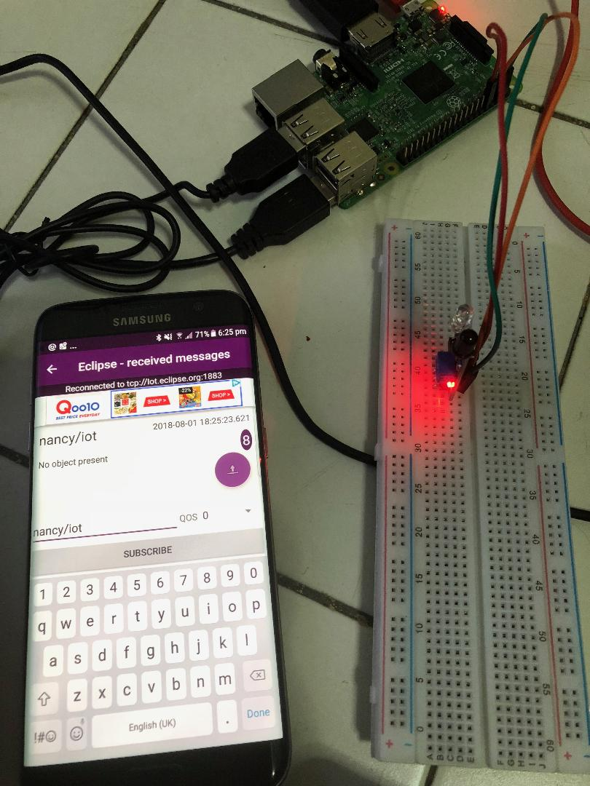

Design_Publish_Raspberrypi_Proximitysensor_only_change_of_State
=============================================================

Design a setup to publish data from proximity sensor, only when there is change
in state by monitoring regularly.

The subscribing client is the smartphone, where we can get data remotely using
MQTT protocol.

Requirements:

-   Raspberry pi 3

-   Proximity Sensor

-   Bread Board, Jump wires

-   Android Phone

Publish Client : Raspberry Pi

MQTT Broker : iot.eclipse.org

Subscribe Client : Smart Phone

Code : Python

